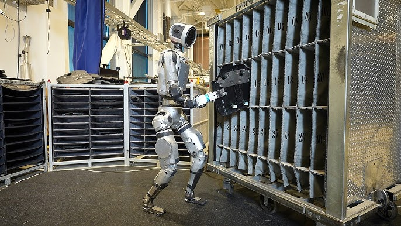
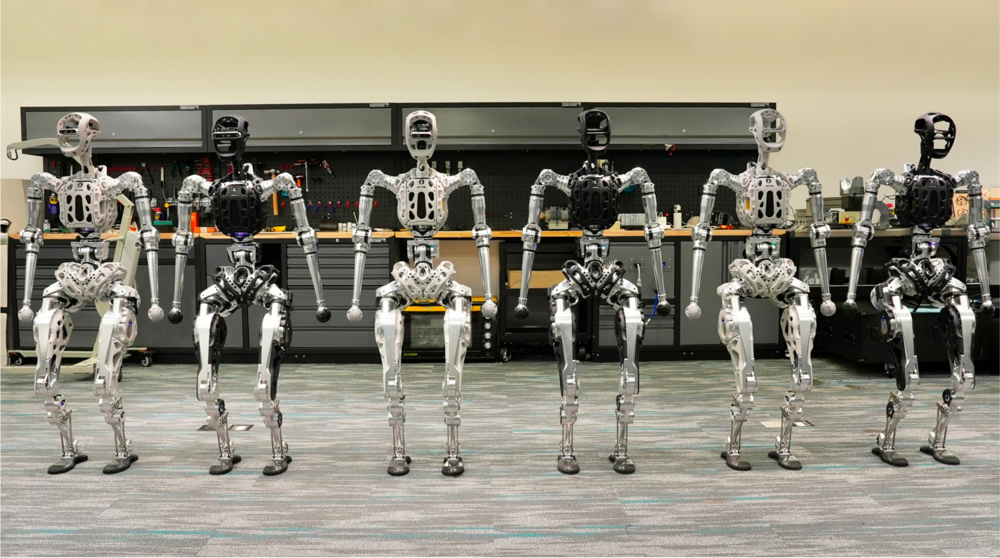
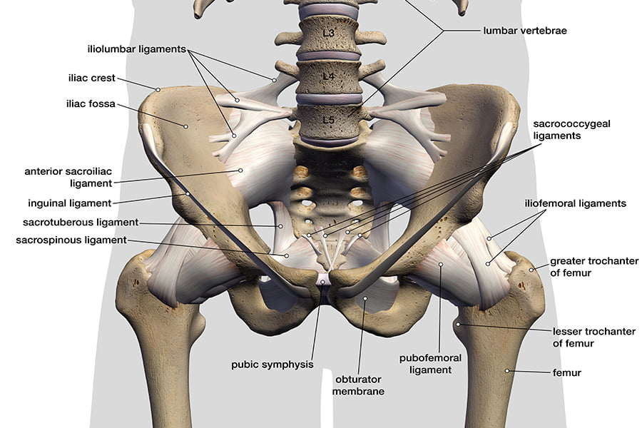
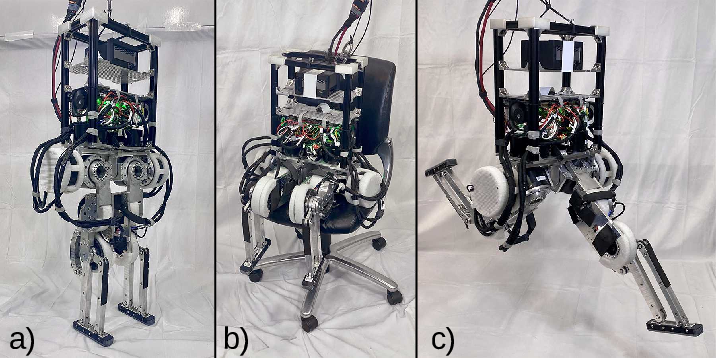
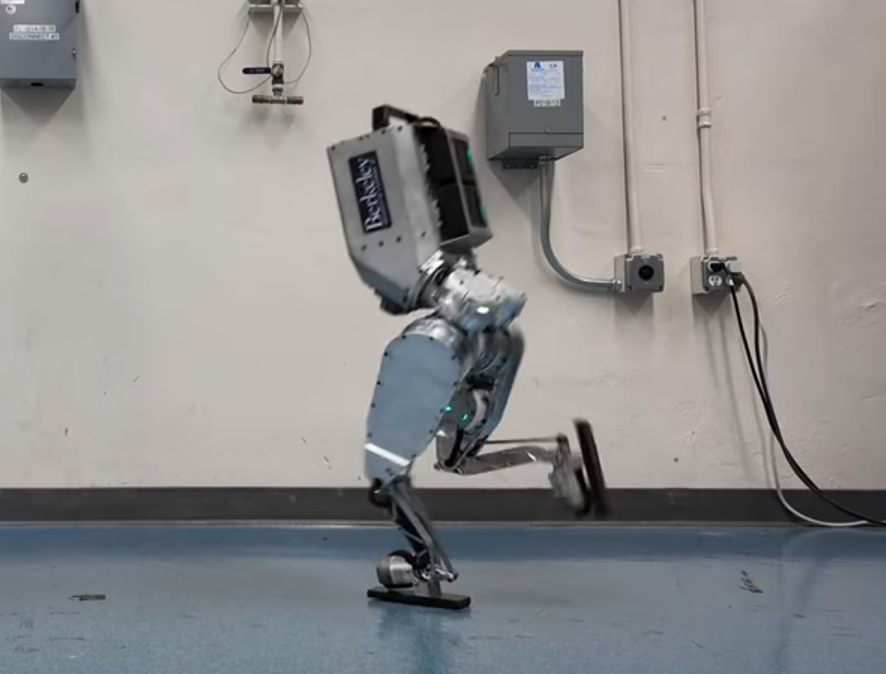
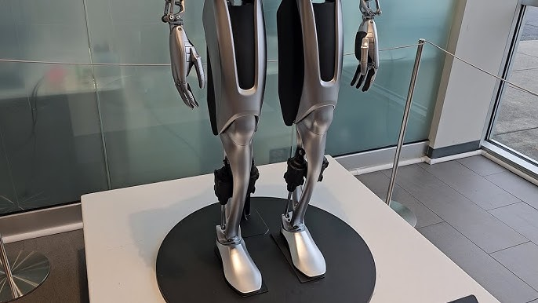
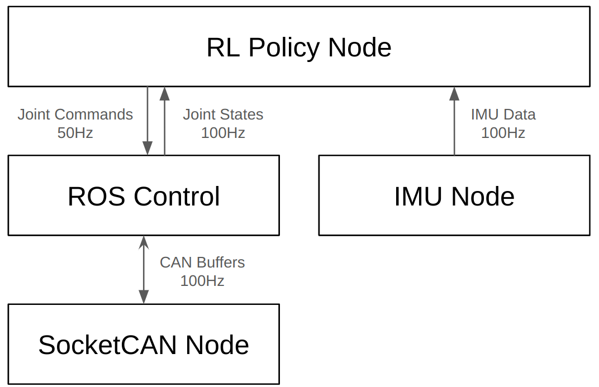
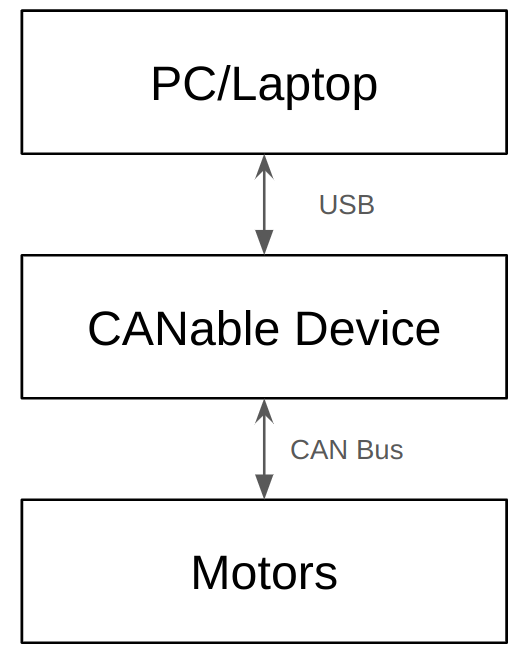

# Project Proposal: Northwestern Humanoid
## 1. Abstract
I developed a middle-sized humanoid robot from scratch independently. For the mechanical design side, I applied an offset angle to the pelvis, and manufactured the hardwarew with 3D printing. For the locomotion algorithm side, I designed a set of reward funcitons and applied PPO reinforcement learning with [rsl_rl]() library and [Genesis]() simulator to make the humanoid robot walking. In conclusion, after this 10-week project, I developed the humanoid robot hardware, interfaced motors and sensors with ROS, and made the robot walking in simulation with a RL policy.

## 2. Motivation
To provide clarity before diving into the technical objectives, this section outlines the background of the proposed hardware and software improvements for middle-sized humanoid robots.

### 2.1 Hardware Design
This section discusses two key improvements proposed for the hardware design of middle-sized humanoid robots: the hip design and the ankle design. These improvements aim to enhance energy efficiency, mechanical performance, and alignment with human biomechanics.

#### Hip Design
The hip mechanism in humanoid robots typically includes three degrees of freedom: Hip Roll, Hip Pitch, and Hip Yaw. Conventional designs often separate these actuators orthogonally (at 90-degree angles), as shown in the Atlas robot from Boston Dynamics:

  
   
  <em>Atlas form Boston Dynamics</em>

While this layout simplifies CAD modeling and kinematic analysis, it is not energy-efficient. In humanoid locomotion, the most frequently used motion is forward and backward leg movement, which relies on the Hip Pitch degree of freedom. In the conventional 90-degree design, only one motor contributes to Hip Pitch motion, requiring that motor to handle significant torque demands for high payloads.

An alternative design, seen in robots like Adam Lite from PNDbotics, positions the hip actuators at 45-degree angles, forming a triangular arrangement:

  
   
  <em>Adam Lite form PNDbotics</em>

This configuration enables all three motors in the hip joint to work together during Hip Pitch movements, reducing the torque demands on any single motor and improving energy efficiency. Additionally, this design mirrors the biomechanics of the human hip:

  
   
  <em>Image Source: https://zehrcenter.com/ligaments-tendons-muscles</em>

By aligning with natural human anatomy, this design not only enhances mechanical efficiency but also contributes to a more biomimetic approach in humanoid robot development.

#### Ankle Design

Designing dual degrees of freedom for the ankle joint (Ankle Roll and Ankle Pitch) is relatively straightforward in full-sized humanoid robots due to the ample available space. However, in middle-sized humanoid robots, limited space creates significant challenges. Robots like the MIT Humanoid [1] and Duke Humanoid [2] address this constraint by including only an Ankle Pitch degree of freedom:

  
   
  <em>MIT Humanoid</em>

  
   
  <em>Duke Humanoid</em>

The Berkeley Humanoid [3] attempts to overcome this limitation by adding a small motor to achieve Ankle Roll:

  
   
  <em>Berkely Humanoid</em>

However, this solution increases the rotational inertia of the calf, which negatively impacts the dynamic performance of the leg. To address this, I propose an alternative solution inspired by Tesla's Optimus robot. While Optimus is a full-sized humanoid that places two motors on the calf, it utilizes a linkage-rod structure to control the Ankle Roll and Pitch:

  
   
  <em>Feet Design of Optimus from Tesla</em>

Instead of placing motors on the calf, my design proposes locating the ankle motors on the thigh and using a similar linkage-rod mechanism to control both Ankle Roll and Pitch. This approach minimizes the rotational inertia of the calf, enabling more dynamic and efficient leg movements while preserving the dual degrees of freedom at the ankle. By redistributing the motors to the thigh, the design would achieve a better balance between functionality and mechanical constraints.

### 2.2 Software Design
The software architecture for this project consists of two key components: 1. Hardware Interface and 2. Locomotion Algorithm.

#### Hardware Interface
For the hardware interface, I plan to leverage **ROS Control**, which provides a modular and standardized framework for robot hardware abstraction and controller management. Since the motor protocols operate over **CAN (Controller Area Network)**, I will use the **SocketCAN-Bridge** in ROS to enable seamless communication with the motors via the CAN protocol.

#### Locomotion Algorithm

For the locomotion algorithm, I plan to implement **Deep Reinforcement Learning (DRL)** using the **Proximal Policy Optimization (PPO)** algorithm to train a walking policy in simulation. Once trained, the policy will be deployed and tested on the real robot hardware.

I have already validated this pipeline in previous work, where I used the [rsl_rl](https://github.com/leggedrobotics/rsl_rl) library with custom hand-crafted reward functions to train a my humanoid robot walking.

## 3. Method
### 3.1 Overview

  
   
  <em>Software Architecturea</em>

  
   
  <em>Hardware Architecturea</em>

### 3.2 Hardware Design
See example CAD model on OnShape: [https://cad.onshape.com/documents/613c3df8abc961108c3f5f9d/w/ddd0f53b509b97ba59a463ed/e/332974da65372d7783bf2f26?renderMode=0&uiState=67de7d0ea2ea0a78a6fd66ae](https://cad.onshape.com/documents/613c3df8abc961108c3f5f9d/w/ddd0f53b509b97ba59a463ed/e/332974da65372d7783bf2f26?renderMode=0&uiState=67de7d0ea2ea0a78a6fd66ae)

  
   
  <em>Example CAD Model</em>

  
   
  <em>Full CAD Model</em>

### 3.2 Reinforacement Learning

https://github.com/user-attachments/assets/b38f5260-8ca4-47f0-b4c2-bad7fd30dd0a
